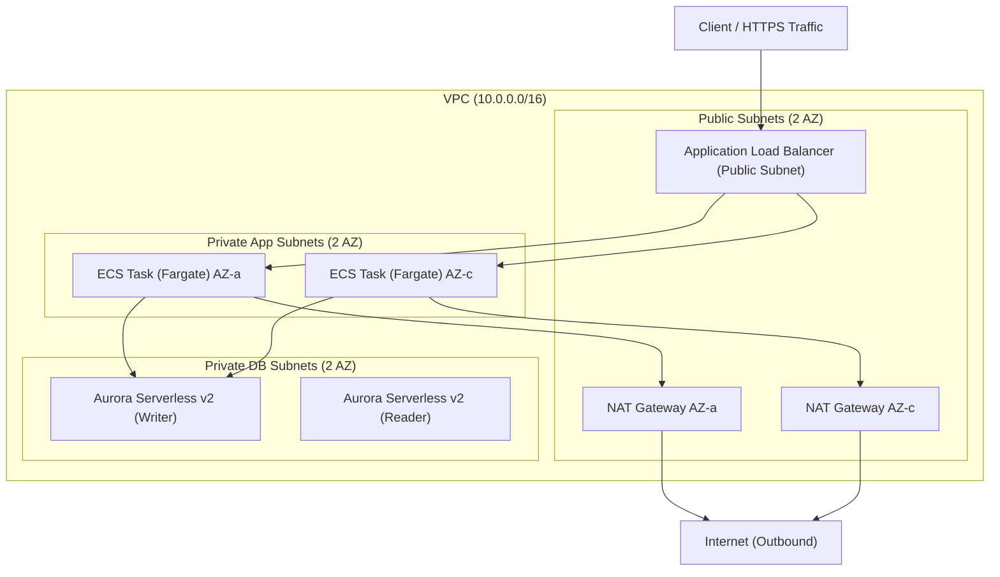

# terraform-aws-fargate-api-base 🚀

実務で最も需要の高い、堅牢かつシンプルな **AWS ECS on Fargate コンテナ型 Web API 基盤** の Terraform テンプレートです。
過度なサードパーティモジュールへの依存や複雑な抽象化を排除し、保守性と拡張性を両立した実戦的 IaC 設計を採用しています。

---

## 💡 アーキテクチャの要点

- **高可用性・耐障害性**: 2 AZ にまたがる冗長構成（Multi-AZ ALB / ECS Fargate / Aurora Serverless v2）。
- **堅牢なセキュリティ境界**: パブリック（ALB / NAT）、プライベート（ECS）、データベース（RDS）の 3 層サブネット分離。コンテナへの直接アクセスは一切遮断。
- **運用の標準化**: AWS Secrets Manager による認証情報分離、CloudWatch Logs への集約、ECS Exec によるセキュアなコンテナ保守。
- **オートスケーリング**: CPU / メモリ使用率に基づく Target Tracking スケーリング対応。

---

## 🎨 インフラ構成図 (Architecture Diagram)



---

## 📂 ディレクトリ構成

```text
terraform/
├── environments/
│   ├── dev/                    # 開発環境デプロイ定義
│   │   ├── main.tf
│   │   ├── variables.tf
│   │   ├── terraform.tfvars
│   │   └── backend.tf
│   └── prod/                   # 本番環境デプロイ定義
│       └── ...
└── modules/                    # 自作ドメインモジュール
    ├── network/                # VPC, Subnet, RouteTable, NATGW
    ├── compute/                # ALB, ECS (Fargate), ECR, IAM
    └── database/               # Aurora Serverless v2, Secrets Manager
```

---

## 🛠️ デプロイ手順

### 1. 前提条件
- Terraform `v1.5+` (または OpenTofu)
- AWS CLI (認証情報設定済み)
- S3 バケット & DynamoDB テーブル (Remote State 管理用)

### 2. デプロイ実行
```bash
# 対象環境のディレクトリへ移動
cd terraform/environments/dev

# 初期化
terraform init

# 実行計画の確認
terraform plan

# インフラのプロビジョニング
terraform apply
```

---

## 🎭 キャスト（制作クレジット）

- agent🔵 : 要件定義・アーキテクチャ骨子設計
- agent🍇 : ネットワーク・モジュール境界設計
- agent🍊 : Terraform HCL 実装・インフラ構築
- agent🟢 : セキュリティ監査・品質検証